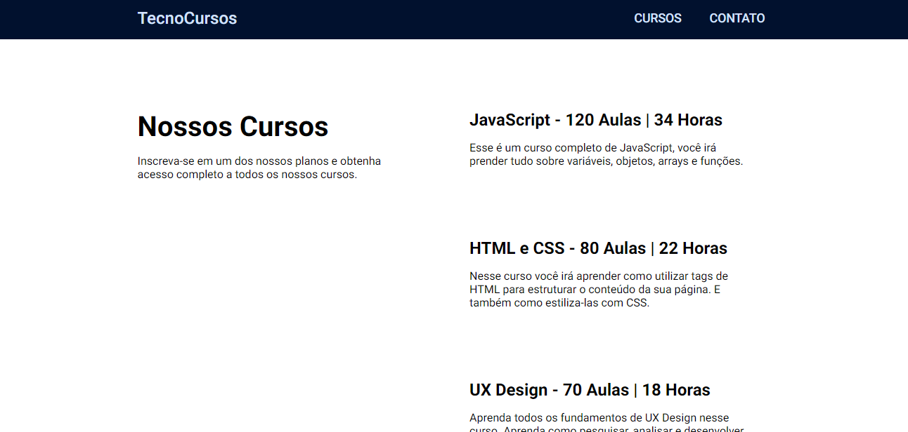

<div align="center">
  <a href="http://tecno.kauadev.xyz">
    <h1>Tecno Cursos</h1>
  </a>

  <p align="center">
    Apenas um projeto para testar meus conhecimentos em VueJS
</div>

## Sobre o projeto



Esse é apenas um projeto para treinar meu VueJS que estou apredendo no curso da Origamid, você pode acessalo clicando [aqui](http://tecno.kauadev.xyz).

Nesse projeto tem algumas das principais tecnologias do Vue, como o Vue Router.

Esse projeto foi desenvolvido absolutamente do 0, juntamente com uma API que fiz em PHP. você pode ve-la clicando [aqui](http://api.kauadev.xyz/tecnocursos/), ela possui acessos por id, ex: `http://api.kauadev.xyz/tecnocursos/cursos`, facilitando o processo.

Este projeto foi desenvolvido como parte de minha jornada de aprendizado de VueJS, que estou estudando através do curso da Origamid, você pode acessa-lo clicando [aqui](http://tecno.kauadev.xyz).

Ele inclui algumas das principais tecnologias do Vue, como o Vue Router, e foi criado inteiramente a partir do zero. Além disso, criei uma API em PHP para complementar o projeto, que pode ser acessada através do link : `http://api.kauadev.xyz/tecnocursos/`.

Essa API possui recursos de acesso por ID, o que facilita o processo de consulta, veja um exemplo:

```
http://api.kauadev.xyz/tecnocursos/cursos
```

isso irá retornar:

```json
{
  "id": "cursos",
  "titulo": "Cursos",
  "descricao": "Inscreva-se em um dos nossos planos e obtenha acesso completo a todos os nossos cursos.",
  "cursos": [
    {
      "id": "javascript",
      "nome": "JavaScript",
      "totalAulas": 120,
      "horas": 34,
      "descricao": "Esse \u00e9 um curso completo de JavaScript, voc\u00ea ir\u00e1 prender tudo sobre vari\u00e1veis, objetos, arrays e fun\u00e7\u00f5es."
    },
    {
      "id": "html-e-css",
      "nome": "HTML e CSS",
      "totalAulas": 80,
      "horas": 22,
      "descricao": "Nesse curso voc\u00ea ir\u00e1 aprender como utilizar tags de HTML para estruturar o conte\u00fado da sua p\u00e1gina. E tamb\u00e9m como estiliza-las com CSS."
    },
    {
      "id": "ux-design",
      "nome": "UX Design",
      "totalAulas": 70,
      "horas": 18,
      "descricao": "Aprenda todos os fundamentos de UX Design nesse curso. Aprenda como pesquisar, analisar e desenvolver um projeto com foco na experi\u00eancia do usu\u00e1rio."
    }
  ]
}
```

<br />

### Construído com

Esse projeto foi construido totalmente com VueJs, sem nenhum outro Framework ou biblioteca.

<br />

## Setup do projeto

```
npm install
```

### Compila e faz hot-reloads para desenvolvimento

```
npm run serve
```

### Compila e minifica para produção

```
npm run build
```

### Lints e corrige arquivos

```
npm run lint
```

### Personalizar configuração

Veja [Configuration Reference](https://cli.vuejs.org/config/).
